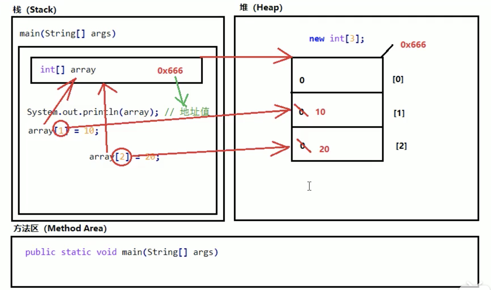

形象介绍介绍一下java的内存划分（笔记），主要分为5个部分：

1. 栈（Stack）：存放的都是方法中的局部变量；方法的运行在栈当中。

   局部变量：方法的参数，或者是方法{}内部的变量

   作用域：一旦超出作用域，立刻从栈内存释放

2. 堆（Heap）：凡是new出来的（对象/基础类型），都存放在堆内存中。

   堆内存的存放的（对象）都有一个地址值：16进制

   堆内存里面的数据都有默认值。规则：

   a. 若为整数`int`：默认值为`0`；

   b. 若为浮点数`float`：默认值为`0.0`；

   c. 若为字符`char`：默认值为`'\u0000'`;

   d. 若为布尔值`boolean`：默认值为`false`；

   e. 若为引用类型：默认值为`null`  

3. 方法区（Method Area）：存储的是`.class`相关信息，包含方法的信息

4. 本地方法栈（Native Method Stack）：与操作系统相关

5. 寄存器（PC Register）：与CPU相关

**代码：**

```java
public class DemoMemory {
    public static void main(String[] args) {
        int[] array = new int[3];
        System.out.println(array);
        System.out.println(array[0]);
        System.out.println(array[1]);
        System.out.println(array[2]);
        System.out.println("==============");

        array[1] = 10;
        array[2] = 20;
        System.out.println(array);
        System.out.println(array[0]);
        System.out.println(array[1]);
        System.out.println(array[2]);

    }
}
```

**运行结果：**

```java
[I@1d44bcfa
0
0
0
==============
[I@1d44bcfa
0
10
20
```

**内存分布图：**



**附件：**

- [解决hexo插入图片的问题](https://www.dazhuanlan.com/2019/12/18/5df99e24d6d27/)

- [视频简介](https://www.bilibili.com/video/BV1A4411K7Gx?p=86)

